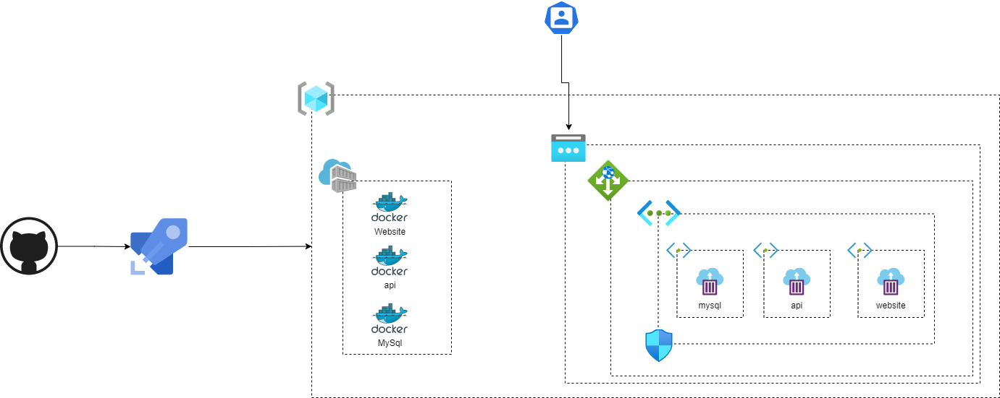

# demo-containers

# Instructions
## Without docker-compose


docker run --name container-test ubuntu:latest /bin/echo 'Hello world'
 

STEPS:

ENTRAR NO TERMINAL LINUX
DB
>> Criar a imagem do banco
docker build -t mysql-image -f api/db/Dockerfile .
docker image ls

>> Subir o container do banco
docker run -d --rm --name mysql-container mysql-image
docker ps
docker run -d -v "$(pwd)/api/db/data:/var/lib/mysql" --rm --name mysql-container mysql-image

>> Conectar em modo iterativo (mostrar banco novo zerado)
docker exec -it mysql-container /bin/bash

>> Conectar cliente MySQL
mysql -uroot -pskaylink
>
show databases;

>> Importar os dados (abrir o script e falar sobre)
docker exec -i mysql-container mysql -uroot -pskaylink < api/db/script.sql

>> Conectar cliente MySQL (mostrar de novo agora com dados)
mysql -uroot -pskaylink
>
use skaylinkbr;
show tables;
select * from people;
-----------------------------------------------------------
ENTRAR NO TERMINAL WINDOWS
API
entrar no dir raiz
npm init
responder questoes
npm install
-----------------------------------------------------------

>> Mostrar o api/src/index.js
//Pegar o ip do banco
//docker inspect mysql-container

>> Criar a imagem do API server
docker build -t node-image -f api/Dockerfile .

>> Subir o container do API server
docker run -d -v $(pwd)/api:/home/node/app -p 9001:9001 --link mysql-container --rm --name node-container node-image
docker run -d -v $(pwd)/api:/home/node/app --link mysql-container --rm --name node-container node-image


>> Mostrar o website/index.php
docker build -t php-image -f website/Dockerfile .
docker run -d -v $(pwd)/website:/var/www/html -p 8888:80 --link node-container --rm --name php-container php-image


-----------------------------------------------------------


volume do banco
-v $(pwd)/api/db/data/var/lib/mysql

## With docker-compose

```
docker-compose up
...
docker-compose down
```
-----------------------------------------------------------
## Terraform
- run the `az login` 
- `demo-containers/terraform-live/terraform-acr` will create the Azure Container Registry to place the db, api and website docker images
- `demo-containers/terraform-live/terraform-acg` will create the public ip, nsg, vnet, subnets, container group (instance) and application gateway
### terraform-acr
```
terraform init
terraform plan -var-file "../dev.tfvars" -out "dev.plan"
terraform apply "dev.plan"
terraform destroy -var-file "../dev.tfvars"
```
- Get the crendentials of the ACR and run the `az acr login --name <acrName>`
### mysql
* docker-compose up --build -d
* docker-compose down
* docker-compose push
### api
* Create a container instance to api
    * Use the port 9001
* docker-compose up --build -d
* docker-compose down
* docker-compose push
### webiste
* Create a container instance to website
    * Use the port 8888
* docker-compose up --build -d
* docker-compose down
* docker-compose push

### terraform-acg
```
terraform init
terraform plan -var-file "../dev.tfvars" -out "dev.plan"
#add the name of the ACR
terraform apply "dev.plan"
terraform destroy -var-file "../dev.tfvars"
```

## Pipeline
- ServicePrincipal with access to the Subscription level
- Use the `azure-pipelines.yaml`
  - Stage QualityCheckStage will perform the verification in the tf files using the tfsec container and run the Trivy command to check vulnerabilities in the docker files
  - planAcr and applyAcr will plan and create the ACR resource in the RG. Also a separeated resource group will be create to store the tf state files check [azure-setup.yam](./pipelines/templates/steps/azure-setup.yaml)
  - Using the terraform output, the name of the ACR will be collected and saved as a variable
  - The mysql, api and website images will be built and pushed
  - planAcg and applyAcg will create the nsg, vnet, subnet, acg with the container images, public ip and application gateway
- After the mysql ACG was created, connect on it and run the commands
```
mysql -uroot -pskaylink
CREATE DATABASE IF NOT EXISTS skaylinkbr;
USE skaylinkbr;

CREATE TABLE IF NOT EXISTS people (
  id INT(11) AUTO_INCREMENT,
  full_name VARCHAR(255),
  email VARCHAR(255),
  title VARCHAR(100),
  location_name VARCHAR(100),    
  PRIMARY KEY (id)
);

INSERT INTO people VALUE(0, 'Luningning Ingmar', 'luningning.ingmar@contoso.com', '', '');
INSERT INTO people VALUE(0, 'Matty Finn', '', '', '');
INSERT INTO people VALUE(0, 'Laura Jef', '', 'Support Specialist', '');
INSERT INTO people VALUE(0, 'Lise Sesto', '', '', '');
INSERT INTO people VALUE(0, 'Hartwin Aang',  '', 'Support Specialist', 'Springfield');
INSERT INTO people VALUE(0, 'Aldegund Lena', 'aldegund.lena@contoso.com', '', '');
INSERT INTO people VALUE(0, 'Gabrijel Torcull', '', 'IT Support Coordinator', 'Springfield');
INSERT INTO people VALUE(0, 'Cathalán Toufik', 'cathalan.toufik@contoso.com', '', '');
```
- Access the app from the public ip
## Diagram


## Links used:

- https://docs.microsoft.com/en-us/azure/container-instances/container-instances-application-gateway
- https://truestorydavestorey.medium.com/how-to-get-an-azure-container-instance-running-inside-a-vnet-with-a-fileshare-mount-using-terraform-a12f5b2b86ce
- https://registry.terraform.io/providers/hashicorp/azurerm/latest/docs/resources/mysql_database